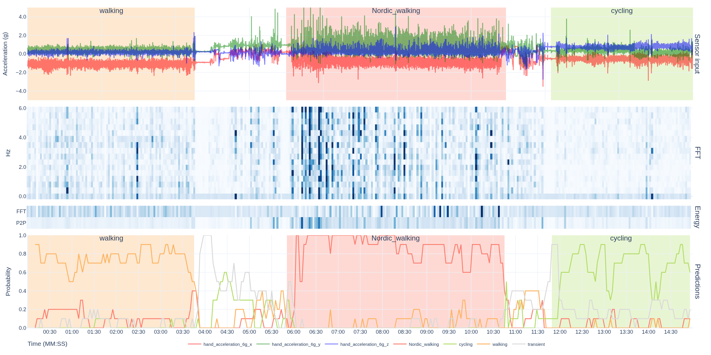

---
title: 'emlearn-micropython: Machine Learning and Digital Signal Processing for MicroPython'
tags:
  - MicroPython
  - TinyML
  - Machine Learning
  - Microcontroller
  - Embedded Systems
authors:
  - name: Jon Nordby
    orcid: 0000-0002-0245-7456
    affiliation: "1"
affiliations:
 - name: Soundsensing, Norway
   index: 1
date: 19 January 2025
bibliography: paper.bib

---

# Summary

emlearn-micropython enables sensor data analysis on low-cost microcontrollers.
The library provides implementations of a set of algorithms commonly used for sensor data processing.
This includes Digital Signal Processing techniques such as Infinite Impulse Response and Fast Fourier Transform,
as well as Machine Learning inference such as Random Forest, Nearest Neighbors and Convolutional Neural Networks.
Any kind of sensor data can be processed, including audio, images, radar, and accelerometer data.

The library builds on MicroPython, a tiny Python implementation designed for microcontrollers.
The modules expose high-level Python API and implemented in C code for computational efficiency.
This enables engineers, researchers and makers that are familiar with Python,
to build efficient embedded systems that perform automatic analysis of sensor data.
A range hardware architectures are supported, including ARM Cortex M, Xtensa/ESP32 and x86-64.

# Statement of need

Over the last decade, it has become possible to create low-cost embedded devices that can automatically collect and analyze sensor data.
These devices often combine one or more MEMS sensors with a microcontroller,
and then using a combination of digital signal processing and machine learning algorithms to extract relevant information from the sensors.
The development and utilization of such systems is an active area of research
with a wide range of applications in science, industry and consumer products[@tinyml_review_ray2022].

Python is among the most commonly used application language for machine learning and data science.
Thanks to the MicroPython[@micropython] project, it has become feasible to use Python also on microcontrollers,
and this is an attractive proposition for practictioners that are familiar with Python.
However, research has identified that running computationally-intensive algorithms in Python
with MicroPython can be inefficient[@plauska_performance_2023; @ionescu_investigating_2020; @dokic_micropython_2020].
This also limits the effectiveness of tools that generate Python code, such as m2cgen[@m2cgen].

The library ulab[@ulab] implements efficient numeric computing facilities for MicroPython,
including the core parts of numpy[@numpy], plus some parts of scipy[@scipy].
However, as of 2025 there are no implementations of machine learning algorithms available in ulab.

OpenMV[@OpenMV] is a project for machine-vision/computer-vision applications using high-end microcontrollers.
They have their own distribution of MicroPython, which includes some additional DSP and ML functionality,
including image and audio classifiers based on TensorFlow Lite for Microcontrollers[@tflite_micro].
However, their solution only officially supports the OpenMV hardware, which limits applicability. 

For these reasons, we saw a need to develop a software library for MicroPython, with following properties:
1) supports inference for common machine learning algorithms,
2) is computationally efficient (in terms of execution speed, program space and RAM usage),
3) run on any hardware supported by MicroPython,
4) can be installed in a easy manner.

Our goal is to make research and development in applied machine learning for embedded systems
easier for those that prefer developing in Python over conventional C or C++.
We believe that this is attractive for many researchers and engineers, and also highly relevant in an educational context.

Within one year of the first release,
emlearn-micropython was referenced in a work for on-device learning of decision-trees[@karavaev2024tinydecisiontreeclassifier].

# Package contents

The emlearn-micropython software package provides a selection of machine learning inference algorithms,
along with some Digital Signal Processing functions.
The algorithms have been selected based on what is useful and commonly used in embedded systems for processing sensor data.
The implementations are designed to be compatible with established packages,
notably scikit-learn[@scikit-learn], Keras[@keras] and scipy[@scipy].
\autoref{table_emlearn_micropython_modules} provides an listing of the provided functionality.

The software is distributed as MicroPython native modules[@micropython_native_module],
which can installed at runtime using the `mip` package manager.
The modules provided by emlearn-micropython are independent of eachother, and typically a few kilobytes large.
This makes it easy to install just what is needed for a particular application,
and to fit in the limited program memory provided by the target microcontroller.

| Module             | Description                          | Corresponds to |
|:-------------------|:-------------------------------------|:----------------------------------|
| emlearn_trees      | Decision tree ensembles              | sklearn RandomForestClassifier    |
| emlearn_neighbors  | Nearest Neighbors                    | sklearn KNeighborsClassifier      |
| emlearn_cnn        | Convolutional Neural Network         | keras Model+Conv2D                |
| emlearn_linreg     | Linear Regression                    | sklearn ElasticNet                |
| emlearn_fft        | Fast Fourier Transform               | scipy.fft.fft                     |
| emlearn_iir        | Infinite Impulse Response filters    | scipy.signal.sosfilt              |
| emlearn_arrayutils | Fast utilities for array.array       | N/A                               |
 
Table: Overview of modules provided by emlearn-micropython \label{table_emlearn_micropython_modules}

Most of the modules are implemented as wrappers of functionality provided in the emlearn C library[@emlearn].
However, the emlearn_cnn module is implemented using the TinyMaix library[@TinyMaix].

# Usage example

As an illustrative example of sensor data analysis with emlearn-micropython,
we show how data from accelerometer can be used to recognize human activities.
This can be deployed for example in a fitness bracelet or smartphone.

The data is taken from the PAMAP2 Physical Activity Monitoring dataset[@pamap2_dataset].
Tri-axial data stream from the wrist-mounted accelerometer is split into consecutive fixed-length windows.
Each window is then processed using Fast Fourier Transform (with `emlearn_fft`),
to extract the energy at frequencies characteristic of walking and running.
These features are then classified using a Random Forest Classifier (with `emlearn_trees`).
The data at the various processing stages is illustrated on a few minutes of data in \autoref{fig:physical_activity_recognition_pipeline}.

{#fig:physical_activity_recognition_pipeline width=100% }

For more comprehensive examples, see the example code provided in the
emlearn-micropython documentation[^emlearn_micropython_documentation].

[^emlearn_micropython_documentation]: Documentation at https://emlearn-micropython.readthedocs.io

# Acknowledgements

We would like to thank
Volodymyr Shymanskyy for his work on improving native module support in MicroPython,
Damien P. George and Alessandro Gatti for fixes to native modules,
and Jeremy Meyer for user-testing of the emlearn_cnn module.

Soundsensing has received finanical support in the period
from the Research Council of Norway for the EARONEDGE project (project code 337085). 

# References

